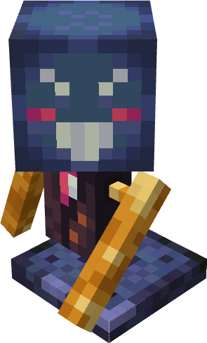

# Animatronic

{ align=left width="65" }
This peripheral is used by the Animatronic. It is an electronic puppet that can be positioned however needed.

The transition from one pose to a new one is fully automatic. And rusty.

## Metadata

| | |
|-|-|
| Peripheral | v1 |
| Attach name | `"animatronic"` |

---

## Functions

### `setFace(face)`
Changes the face of the Animatronic.

**Parameters**

 1. `face`: [string](https://www.lua.org/manual/5.1/manual.html#5.4) The new face. Must be either `"normal"`, `"happy"`, `"question"` or `"sad"`.

**Throws**

 1. Whenever the given string is not one of those types.

---

### `push()`
Pushes the stored rotation values to the Animatronic.  
After pushing them, every rotation gets reset to `0`.

---

### `setHeadRot(x, y, z)`
Sets the head rotation.  
Can only be set within the bounds -180° to 180° for `X`, `Y` and `Z`.

**Parameters**

 1. `x`: [number](https://www.lua.org/manual/5.1/manual.html#2.2) The X rotation.
 2. `y`: [number](https://www.lua.org/manual/5.1/manual.html#2.2) The Y rotation.
 3. `z`: [number](https://www.lua.org/manual/5.1/manual.html#2.2) The Z rotation.

---

### `setBodyRot(x, y, z)`
Sets the body rotation.  
Can only be set within the bounds -180° to 180° for `X`, `Y` and `Z`.

!!! info
    `X` can be set within 360°.

**Parameters**

 1. `x`: [number](https://www.lua.org/manual/5.1/manual.html#2.2) The X rotation.
 2. `y`: [number](https://www.lua.org/manual/5.1/manual.html#2.2) The Y rotation.
 3. `z`: [number](https://www.lua.org/manual/5.1/manual.html#2.2) The Z rotation.

---

### `setLeftArmRot(x, y, z)`
Sets the left arm rotation.  
Can only be set within the bounds -180° to 180° for `X`, `Y` and `Z`.

**Parameters**

 1. `x`: [number](https://www.lua.org/manual/5.1/manual.html#2.2) The X rotation.
 2. `y`: [number](https://www.lua.org/manual/5.1/manual.html#2.2) The Y rotation.
 3. `z`: [number](https://www.lua.org/manual/5.1/manual.html#2.2) The Z rotation.

---

### `setRightArmRot(x, y, z)`
Sets the right arm rotation.  
Can only be set within the bounds -180° to 180° for `X`, `Y` and `Z`.

**Parameters**

 1. `x`: [number](https://www.lua.org/manual/5.1/manual.html#2.2) The X rotation.
 2. `y`: [number](https://www.lua.org/manual/5.1/manual.html#2.2) The Y rotation.
 3. `z`: [number](https://www.lua.org/manual/5.1/manual.html#2.2) The Z rotation.

---

### `getStoredHeadRot()`
Returns the current stored head rotation.

**Returns**
 1. `number` The X rotation
 2. `number` The Y rotation
 3. `number` The Z rotation

---

### `getStoredBodyRot()`
Returns the current stored body rotation.

**Returns**
 1. `number` The X rotation
 2. `number` The Y rotation
 3. `number` The Z rotation

---

### `getStoredLeftArmRot()`
Returns the current stored left arm rotation.

**Returns**
 1. `number` The X rotation
 2. `number` The Y rotation
 3. `number` The Z rotation

---

### `getStoredRightArmRot()`
Returns the current stored right arm rotation.

**Returns**
 1. `number` The X rotation
 2. `number` The Y rotation
 3. `number` The Z rotation

---

### ` getAppliedHeadRot()`
Returns the rotation of the head.

**Returns**
 1. `number` The X rotation
 2. `number` The Y rotation
 3. `number` The Z rotation

---

### ` getAppliedBodyRot()`
Returns the rotation of the body.

**Returns**
 1. `number` The X rotation
 2. `number` The Y rotation
 3. `number` The Z rotation

---

### ` getAppliedLeftArmRot()`
Returns the rotation of the left arm.

**Returns**
 1. `number` The X rotation
 2. `number` The Y rotation
 3. `number` The Z rotation

---

### ` getAppliedRightArmRot()`
Returns the rotation of the right arm.

**Returns**
 1. `number` The X rotation
 2. `number` The Y rotation
 3. `number` The Z rotation