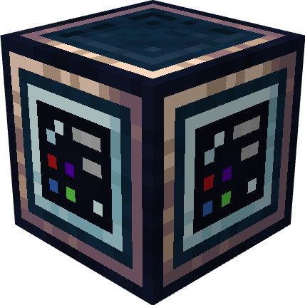

# Source Block

{ align=left width="100" }
This peripheral is used by the **Source Block**. It is used to display data on **Create Display Targets**.

The peripheral acts similar to a normal [Terminal](https://tweaked.cc/module/term.html) with some implementations from the [Window API](https://tweaked.cc/module/window.html). It does not support formatted text.

## Metadata

| | |
|-|-|
| Peripheral | v1.1 |
| Attach name | `"create_source"` |

### Events

The RedRouter can send the following event:

| Name | Description | Parameter 1 |
|------|-------------|-------------|
| `"monitor_resize"` | Whenever the display targets size changes. | `string`: **attatched_name** |

---

## Functions

### `setCursorPos(x, y)`
Sets the position of the cursor. `write` will begin at this position.

**Parameters**

 1. `x`: [number](https://www.lua.org/manual/5.1/manual.html#2.2) The new x position of the cursor.  
 2. `y`: [number](https://www.lua.org/manual/5.1/manual.html#2.2) The new y position of the cursor.  

---

### `write(text)`
Will write the given input to the linked display.

**Parameters**

 1. `text`: [string](https://www.lua.org/manual/5.1/manual.html#5.4) The string to write on the current cursor position.  

---
### `scroll(y)`
Scrolls the content of the display vertically for `y` lines.

**Parameters**

 1. `y`: [number](https://www.lua.org/manual/5.1/manual.html#2.2) How many lines will the display scroll.  

---

### `clear()`
Clears the whole screen.

---

### `clearLine()`
Clears the line at the current cursor position.

---

### `getLine(y)`
Returns the line at the wanted display position.

**Parameters**

 1. `y`: [number](https://www.lua.org/manual/5.1/manual.html#2.2) The y position on the display.  

**Returns**

 1. [string](https://www.lua.org/manual/5.1/manual.html#5.4) The line of the given position.  

**Throws**

 * Whenever the given [number](https://www.lua.org/manual/5.1/manual.html#2.2) is not in the range of `1` to `<terminal height>`.  

---

### `getCursorPos()`
Returns the current cursor position.

**Returns**

 1. `number` The **x** position of the cursor.  
 2. `number` The **y** position of the cursor. 

---

### `getSize()`
Returns the current display size.

**Returns**

 1. `number` The **width** of the **Create Display Target**.  
 2. `number` The **height** of the **Create Display Target**.  